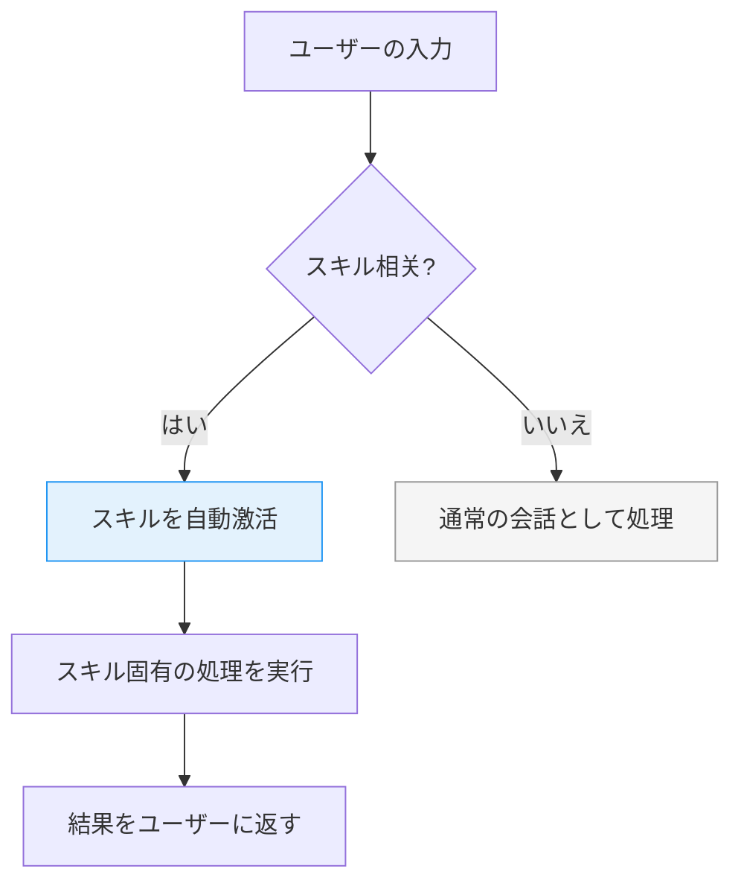
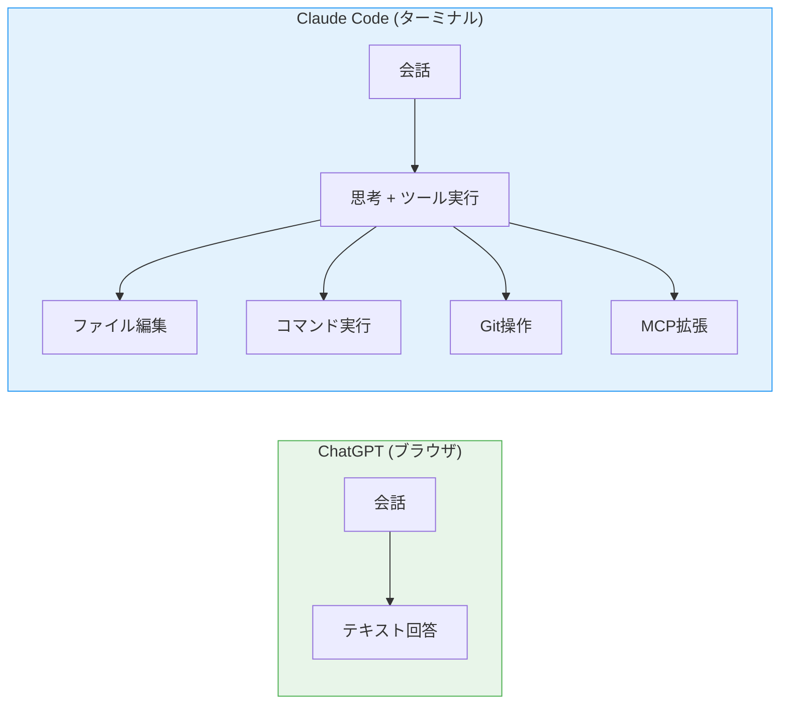

# Claude Code使い方

Claude Codeは、ターミナル（コマンドプロンプト）の中で動くAIアシスタントです。従来のブラウザ上のAI不同的是、**実際のファイルを編集したり、コマンドを実行したり、Git操作もできます**。この章では、Claude Codeの基本的な使い方と、主要な概念をゼロから説明します。

---

## 1. Claude Codeのはじまり方

### 起動コマンド

ターミナルで以下のコマンドを入力します。

```bash
$ claude
```

そうすると、対話モードが始まり、以下のような画面が表示されます。

```bash
$ claude
Building context from recent files...


 Claude CodeではじめるAIコーディング

何かお手伝いできることはありますか？
>
```

「`>`」のカーソルにそのまま日本語や英語の質問・指示を入力して、Enterで送信します。終了するには `/exit` と入力します。

### 終了のしかた

| 方法 | 操作 |
|------|------|
| `/exit` と入力 | 安全に終了 |
| `Ctrl+C` を押す | 強制終了 |

終了した後、同じターミナルで再度 `claude` と打てば、いつでも新しいセッションを始められます。

---

## 2. 許可（Permission）システム

Claude Codeには「許可（Permission）」システムがあります。Claudeは**危険な操作を実行する前に、必ず確認を求めてきます**。これは、AIが誤った命令を解釈して取り返しのつかない操作をするのを防ぐための安全装置です。

### 許可を求める場面の例

| 操作 | なぜ確認されるか |
|------|----------------|
| `rm -rf /` |ファイル完全削除。取り消せない |
| `DROP DATABASE` |データベースの全データが消える |
| 大量のファイル上書き |作業中の内容が失われる |
| 外部ネットワークへの接続 | セキュリティリスク |

### 許可の流れ（フローチャート）

```mermaid
flowchart TD
    A["あなたからの指示<br>「全ファイルを削除して」"] --> B{Claude Code}
    B --> C{危険な操作か?}
    C -->|はい| D["許可を求める<br>「本当に実行しますか?」"]
    D --> E{あなたが<br>"許可する"と回答}
    E --> F["実行"]
    C -->|いいえ| G["そのまま実行"]
    E --> H["拒否して別の<br>方法を提案"]
    style D fill:#fff3cd,stroke:#ffc107
    style F fill:#d4edda,stroke:#28a745
    style H fill:#f8d7da,stroke:#dc3545
```

つまり、Claude Codeは**「可能性がある!」と思った操作は一旦止まって、人間が確認する」**設計になっています。「許可する」と答えない限り、危険な操作は実行されません。

### 許可を预先に与えるには

`~/.claude/settings.json` に許可ルールを書くことで、よく使う安全な操作を预先に許可できます。ただし、`rm -rf` のような高リスク操作は許可ルールの対象外となり、常に確認求められます。

```json
{
  "permissions": {
    "allow": [
      "read all files",
      "run git status",
      "run npm install"
    ]
  }
}
```

ただし、`allow all`（すべて許可）は絶対に設定しないでください。AIが误った判断をした场合に、手遅れになる可能性があります。

---

## 3. 基本的なスラッシュコマンド

Claude Codeでは `/` で始まるコマンドを使って動作を制御します。利用可能なコマンドは以下の通りです。

| コマンド | 役割 |
|----------|------|
| `/help` | 利用可能なコマンドの一覧を表示 |
| `/model` | AIモデルを変更する（例: Opus, Sonnet, Haiku） |
| `/clear` | 画面をクリアする（コンテキストは維持） |
| `/compact` | 長いセッションのコンテキストを压缩して整理する |
| `/exit` | Claude Codeを終了する |

### `/model` でモデルを変更する

```
> /model
変更するモデルを選択:
1. Claude Opus 4 (最も高性能・複雑な推論向き)
2. Claude Sonnet 4 (バランス型・日常使用に最適)
3. Claude Haiku 3 (高速・軽量・シンプルタスク向き)
```

Opus は複雑な分析・コード生成に向き、Sonnet はバランスの取れた選択肢、Haiku は素早い返答が必要なときに便利です。

### `/compact` でコンテキストを整理する

長いセッションで「Claudeの回答がおかしくなってきた」「以前の情報を忘れてきた」と感じたときに `/compact` を使います。Claudeが過去の会話を圧縮して整理し、新たな議論のための空間を作ります。

### `/compact` が効果的なタイミング

- セッションを長く使い続けて、Claudeの回答品質が下がってきたと感じるとき
- 多くのファイルを編集した後、Claudeが前の編集内容を忘れているようなとき
- コンテキストが溢れてエラーが出るとき

`/compact` を実行すると、Claudeはそれまでの会話内容を要約し、重要な情報だけを保持します。作業の流れはそのまま引き継がれるので、会話の途中でも安心して使えます。

---

## 4. 「セッション」という概念

Claude Codeでは、**1回の会話 = 1つのセッション**です。各セッションは独自の「コンテキスト」（文脈）を持ちます。

```
┌─────────────────────────────────────────┐
│セッション A                              │
│  「PythonでWebアプリを作る」                │
│  → auth.py, database.py などの情報保持     │
│  →ユーザーの好みやプロジェクト構成の記憶 │
└─────────────────────────────────────────┘

┌─────────────────────────────────────────┐
│  セッション B                              │
│  「Reactのコンポーネントが動かない」        │
│  → App.jsx, styles.css などの情報保持 │
│  → 別のプロジェクトの文脈は保持しない │
└─────────────────────────────────────────┘
```

**セッションごとにコンテキストは独立**しています。セッションAで学んだことはセッションBには反映されません。これは意図的な設計で、プロジェクトごとに话题を分开でき、雑多な情報が混ざるのを防げます。

### セッションの引き継ぎ（handover）

新しいセッションを始めるときに `/new-session` を使う（または新しいトピック话题を切り离ると）と、Claudeは「前回の続き」についての情報を聞いてきます。ここで概要を渡すことで、新しいClaudeが前回の文脈を理解して継続できます。

```
> /new-session
前回のプロジェクトについて教えてください。
（ auth.py のログイン機能を作っていました）
```

### コンテキストの限界に注意

セッションには「コンテキスト上限」というものがあります。一度に覚えておける情報量には限りがあるため、非常に長いセッションでは以下のような症状が出ることがあります。

- 以前の指示を忘れてしまう
- 同じ質問を繰り返す
- 回答の品質が低下する

こうした場合は `/compact` で整理するか、新しいセッションを始めて引き継ぐのが效果的です。一つのセッションで一日中作業するのではなく、作業の区切りでセッションを切り替えることをお勧めします。

---

## 5. スキル（Skills）とは

スキルは、特定のタスクに備えて自動化された**プロンプトテンプレート**です。あなたが「〜について調査して」「〜を作って」と言ったとき、関連するスキルが自動的に激活します。

```
あなたの入力: 「Deep Researchで○○について調査して」

         ↓ スキルが自動検出
┌──────────────────────────────┐
│  deep-research スキル         │
│  →ウェブリサーチを実行 │
│  → 複数のソースから情報を集約   │
│  → 引用付きの調査レポート生成 │
└──────────────────────────────┘
```

### 主要なスキルの例

|スキル | 何をするか |
|--------|-----------|
| `/code-review` | 変更差分をチェックしてバグ・改善点を指摘 |
| `/deep-research` | WEB上の情報を調査してレポートを生成 |
| `/skill-creator` |新しいスキルを自作して拡張 |
| `/html-guide` | インタラクティブなHTMLヘルプページを生成 |
| `/new-session` | セッションを切り替えて引き継ぎプロンプトを生成 |

スキルは標準で备わっているものもあれば、あなたが自作できるものもあります。「よくやる作业」をスキルとして登録しておくと、同じ指示を简単 반復できて便利です。

### スキルが激活する流れ

スキルは「自動激活」と「手動激活」の2通りがあります。手動激活は `/skill-name` のように直接コマンドを入力する方法です。自動激活は、あなたの入力文をClaudeが分析し、関連するスキルを自動的に選択して実行します。



---

## 6. MCPサーバー（拡張機能）

MCP（Model Context Protocol）サーバーは、Claudeの機能を拡張する「プラグイン」です。デフォルトのClaudeではできないことも、MCPサーバーを追加すればできるようになります。例えば、ブラウザ上のウェブページを操作したり、GitHubのIssueを作成したり、最新のライブラリのドキュメントを検索したりできます。

### MCPサーバーの構成図

```
┌─────────────────────────────────────────────┐
│           Claude Code 本体                    │
│  (ファイル編集・コマンド実行・思考・推論)      │
└──────────────┬───────────────────────────────┘
               │  MCPプロトコル（標準化されたつなぎ口）
 ┌───────┴───────┐
       ↓ ↓       ↓
┌──────────┐ ┌──────────┐ ┌──────────┐
│ GitHub   │ │ Brave │ │ Playwright│
│ MCP      │ │ Search   │ │ MCP       │
│ │ │          │ │ │
│ リポジトリ│ │ WEB検索   │ │ ブラウザ │
│ 操作 │ │ニュース  │ │自动化    │
│ Issue/PR │ │ 画像検索 │ │ 操作 │
└──────────┘ └──────────┘ └──────────┘
```

### 各MCPサーバーのできること

| MCPサーバー | 何ができるか |
|------------|------------|
| `brave-search` | WEB検索・ニュース取得・画像検索 |
| `github` | Issue作成/PR作成・コード検索・リポジトリ操作 |
| `playwright` | ブラウザの自动化操作（クリック・入力・screenshots） |
| `context7` | ライブラリの最新ドキュメントを即时取得 |
| `discord` | Discordチャンネルへの通知・メッセージ取得 |

MCPサーバーは `~/.claude/settings.json` で設定します。具体的な設定方法は『設定とカスタマイズ』の章で説明します。

### MCPの考え方

MCPは「標準化されたつなぎ口」です。つまり、Claude Code側は「MCPというルールに従ってください」というだけで済みます。新しい拡張機能を追加したいときは、そのルールに従ったサーバーを用意するだけで、Claude Code本体を変更する必要はありません。これはスマートフォンのアプリストアと同じ考え方です。

```
スマートフォンの例え:

┌──────────────┐     ┌──────────────┐
│スマートフォン  │     │ Claude Code   │
│（本体）       │     │（本体）       │
└──────┬───────┘     └──────┬───────┘
       │アプリを追加          │MCPサーバーを追加
       ↓                     ↓
┌──────────────┐     ┌──────────────┐
│カメラアプリ   │     │ GitHub MCP   │
│地図アプリ     │     │ Search MCP   │
│音楽アプリ     │     │ Playwright MCP│
└──────────────┘     └──────────────┘
```

この仕組みのおかげで、Claude Codeの機能はユーザー自身が自由に拡張できます。

---

## 7. ChatGPTとの決定的な違い

ここまでの内容を整理すると、Claude CodeとChatGPTの最大の違いが明确になります。

| 機能 | ChatGPT | Claude Code |
|------|---------|------------|
| ファイル編集 |不可 | 可能 |
| コマンド実行 | 不可 | 可能 |
| Git操作 |不可 | 可能 |
| WEB検索 | 一部対応 | MCPで расширяемая |
| ターミナル統合 | なし | ネイティブ統合 |
| プロジェクト単位の作業 | 限定的 | 完全対応 |
| 許可システム | なし | 組み込み済み |



**Claude Codeは「话すだけ」から「実際に行う」に进化したAIツール**です。ただし、その分「許可の確認」が入るなど、安全のための工夫も必要です。

### 使い分けの目安

ChatGPTとClaude Codeは「どちらが優れているか」ではなく、「用途が違う」と理解しましょう。文章のアイデア出しや簡単な質問にはChatGPTが便利です。しかし、実際のコードを編集したり、プロジェクト全体を管理したりする作業にはClaude Codeが圧倒的に向いています。

| 作业内容 | 向いているツール |
|----------|----------------|
| アイデア出し・文章作成 | ChatGPT |
| プログラミング学習の質問 | どちらでも |
| ファイルの編集・コマンド実行 | Claude Code |
| プロジェクト全体の管理 | Claude Code |
| Git操作・テスト実行 | Claude Code |

次の章では、こうしたClaude Codeを効果的に使うための「プロンプトの書き方」を説明します。

---

## 8. コマンドライン引数による起動オプション

`claude` コマンドには様々な启动引数があります。用途に応じて使い分けましょう。

###よく使う起動オプション

| 引数 | 意味 | 使用例 |
|------|------|--------|
| `claude --no-input` | 自動起動せず会話モードのみ | 初期確認のみ済ませたいとき |
| `claude --print <プロンプト>` | 単発実行して即終了 | スクリプト内から呼び出す |
| `claude --resume` | 前回のセッションに再接続 | 作業を引き継ぐとき |

### 単発実行の實際例

```bash
# 単発で質問して即終了
$ claude --print "PythonでHello Worldを表示するコードを見せて"

# ファイルを与えて分析させる
$ claude --print "このコードのバグを直して" < auth.py
```

`--print` はスクリプトや自动化に活用できますが、複雑な作业には対話モードを使うのがおすすめです。

---

## 9. プロジェクトごとの設定ファイル

Claude Codeは `~/.claude/settings.json` で全体設定を、`プロジェクトルート/.claude/settings.json` でプロジェクト별 설정을行えます。

### プロジェクト별設定の例

```
my-project/
├── src/
│   └── app.py
├── tests/
│   └── test_app.py
└── .claude/
    └── settings.json   ← プロジェクトごとの設定
```

このプロジェクト별設定ファイルには、以下のような项目を書けます。

- **許可ルールのoverride**: プロジェクト内でだけ許可する操作
- **利用可能なMCPサーバー**: プロジェクトunikの拡張機能
- **カスタムスキルの登録**: そのプロジェクト専用のスキル

こうすることで、「このプロジェクトではこの操作だけ許可したい」といった精细な制御が可能になります。

---

## 10. ツール呼び出しの流れ

Claude Codeが内部でどのように動いているか、理解しておくとトラブル 대응に便利です。Claudeがファイルを編集したりコマンドを実行したりするとき、以下の流程をたどります。

```
あなた: 「auth.py のログイン関数に空文字チェックを追加して」

 ↓
┌──────────────────────────────┐
│ 1. 理解 (Understanding)     │
│  → プロンプトを解析           │
│  →どのファイル?どの関数?       │
└──────────────┬───────────────┘
               ↓
┌──────────────────────────────┐
│  2. 計画 (Planning)          │
│  → 手順を考える │
│  → 「ファイルを読んで→修正を生成→実行」 │
└──────────────┬───────────────┘
               ↓
┌──────────────────────────────┐
│  3. ツール実行 (Tool Use)      │
│  → Read: auth.py を読み込み      │
│  → Edit: 空文字チェックを追加 │
│  → Bash: テスト実行 │
└──────────────┬───────────────┘
               ↓
┌──────────────────────────────┐
│  4. 回答 (Response)           │
│  → 何をしたかをあなたに報告 │
│  → エラーがあれば報告 │
└──────────────────────────────┘
```

各段階でClaudeは「考える」ことができます，`/compact` はこの「考える」履歴を压缩する操作です。流れを理解しておくと、「なぜここで止まるのだろう」と感じたときに原因を特定しやすくなります。

---

## 11. まとめ：この章で学んだこと

|項目 | 内容 |
|------|------|
| **起動** | `claude` コマンドで対話モード开始 |
| **許可システム** | 危険な操作前に必ず確認・設定で自動化可能 |
| **スラッシュコマンド** | `/help`, `/model`, `/compact` など |
| **セッション** | 会話ごとにコンテキストが独立 |
| **スキル** | 自動化されたプロンプトテンプレート |
| **MCPサーバー** | 拡張可能なプラグイン機能 |
| **ChatGPTとの違い** |ファイル編集・コマンド実行が可能 |

次の章では、こうしたClaude Codeを効果的に使うための「プロンプトの書き方」を説明します。道具の使い方を学んだところで、次は「上手な指示の出し方」を身につけましょう。
