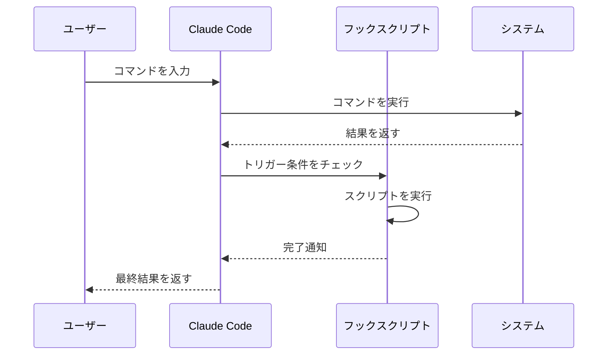

# 05 自動化と拡張

Claude Code はそのままでも強力ですが、設定次第でさらに便利になります。この章では、AI アシスタントの能力を自動的広げる仕組みを説明します。

## 05-1 フック（Hooks）:自動化の核心

フックとは、特定のタイミング自動的に実行されるスクリプトです。Claude Code のワークフローのあらゆる瞬間に、あなたのカスタム処理を差し込めます。

###代表的なフックの種類

|フック名 | 実行タイミング |用途の例 |
|----------|----------------|----------|
| SessionStart | セッション開始時 | 前回の続き读取、最新ファイル確認 |
| AfterEveryGeneration | 各レスポンス生成後 | 作業ログ自動記録、自動コミット |
| BeforeTask | 作业开始前 | プロジェクト状态確認、コンテキスト整備 |
| AfterTool | ツール実行後 | ファイル变更検知、セキュリティチェック |

### フックの動作流れ

以下に、Mermaid を使用してフックの処理流れを可视化管理します。



この流れを見てわかるとおり、フックはClaude Code の动作の合間に介入します。ユーザーは意識せずに、自動化された処理が裏で動いています。

### 実用的なフックの例

以下は、ファイル変更を検出して自動コミットする Bash スクリプトの例です。

```bash
#!/bin/bash
# .claude/hooks/after-tool-check.sh
# 特定のファイルが変更されたら自動コミットする例

TRACKED_FILES=("src/main.ts" "src/utils.ts" "docs/")

for file in "${TRACKED_FILES[@]}"; do
    if git diff --quiet "$file" 2>/dev/null; then
        #変更なし
 :
    else
        echo "[Hook] $file が変更されました"
        git add "$file"
        git commit -m "docs: update $file (auto-commit by hook)"
    fi
done
```

このスクリプトを `settings.json` の соответствующий хукに登録すると、ファイル変更のたびに自動でコミットが行われます。

## 05-2 Cronジョブ:定期実行の自動化

Cron は、時間を指定してタスクを自動実行する仕組みです。Claude Code でも使用可能です。

###典型的なユースケース

- **毎日バックアップ**: 朝の9時にプロジェクトファイルをバックアップ
- **週次レポート**: 週末に作業サマリーを自動生成
- **定期清理**: 古いログファイルを自動削除

### 設定方法

Cron は5つの時間フィールドで動作タイミングを指定します。

```
分 時 日 月 曜日
```

設定例:
- `0 9 * * *` →毎日9:00
- `0 9 * * 1-5` →平日9:00
- `*/15 * * * *` → 15分ごと

## 05-3 MCPサーバー: 拡張機能のplugins

MCP（Model Context Protocol）サーバーは、Claude Code に専門的な機能を追加する「plugins」です。

### 有什么用

MCP サーバーを導入すると、Claude Code が标准で持っていない機能を使えるようになります。

- **Web検索**:最新の情報をオンラインで検索
- **GitHub API**: リポジトリ操作を自動化
- **ファイルシステム**: 高度なファイル操作
- **外部サービス連携**: Discord、Slack など

### 設定方法

`settings.json` に以下のように設定します。

```json
{
  "mcpServers": {
    "web-search": {
      "command": "npx",
      "args": ["-y", "@modelcontextprotocol/server-brave-search"]
    },
    "github": {
      "command": "npx",
      "args": ["-y", "@modelcontextprotocol/server-github"]
    }
  }
}
```

設定後は、Claude Code が再起動なしに新しいツールを利用できるようになります。

## 05-4 スキル（Skills）: 定型応答の再利用

スキルは、特定の ードや状況に対してあらかじめ定義した応答を返す仕組みです。「このような質問が来たら、このプロンプトを実行する」という設定を定義できます。

### 用途の例

- コードレビュー用の定型プロンプト
- 新しいプロジェクトの初期セットアップフロー
- 定例报告の书类型

スキルは主に `~/.claude/skills/` フォルダに Markdownファイルとして保存します。ファイル名をキーワードとして登録し、内容をプロンプトテンプレートとして使えます。

## 05-5 セキュリティ上の注意

自動化は便利ですが、注意点があります。

**自動実行スクリプトのリスク**
- 不用意にファイルを削除するスクリプトは危险です
- 「動作確認なしに自動実行」は避けましょう
- ログを出力して、何动了かを常に記録しましょう

**権限の管理**
- 必要最低限の権限 しましょう
- 削除・上書き権限は慎重に設定します
- テスト環境で確認ってから本番適用します

**外部服务的連携**
- API キーをスクリプトに直接記述しない
- 代わりに环境変数や `.secrets.env` を使用します
- 権限のあるユーザーのみアクセス可能な場所にSecrets を保存します

自動化は生産性を大きく向上させますが、責任も伴います。 小さなリスクから始めて、効果を確認しながら段階的に拡大しましょう。
