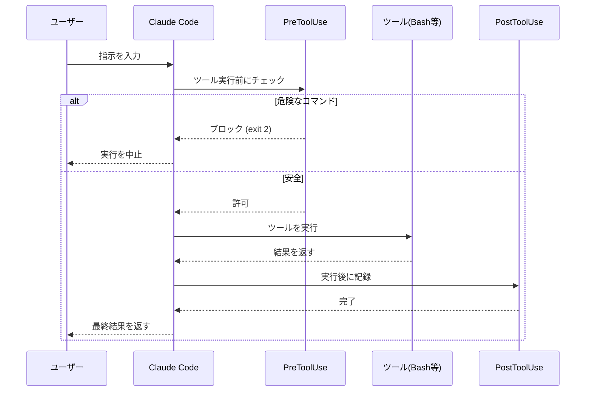

# 06 自動化と拡張

Claude Code はそのままでも強力ですが、設定次第でさらに便利になります。この章では、Claude Code の能力を自動的に広げる5つの仕組み──**フック・Cron・MCPサーバー・スキル・セキュリティ設定**──を、実際に稼働している構成を引き合いに解説します。

> 本章の実例は、Claude Code CLI（WSL2 Ubuntu・GLM-5.2 バックエンド）環境で実際に動いているものです。環境に合わせてパス・スクリプト名は読み替えてください。

## 06-1 フック（Hooks）: 自動化の核心

フックとは、Claude Code のワークフローの特定タイミングで**自動的に実行されるスクリプト**です。ツール実行の前後やセッションの開始・終了など、あらゆる瞬間にカスタム処理を差し込めます。

### 実在するフックタイミング（公式）

Claude Code が提供するフックタイミングは以下の9種類です。**これ以外の名前は実在しません**（`BeforeTask` や `AfterEveryGeneration` のような名前は存在しません）。

| フック | 実行タイミング | 代表的な用途 |
|--------|----------------|--------------|
| `SessionStart` | セッション開始時 | 前回の続き読込・秘密情報のロード・バージョンチェック |
| `UserPromptSubmit` | ユーザー入力送信時 | 入力の前処理・検証 |
| `PreToolUse` | ツール実行**前** | 破壊的コマンドの遮断・権限チェック |
| `PostToolUse` | ツール実行**後** | ファイル変更検知・使用ログ記録 |
| `PostToolUseFailure` | ツール実行失敗時 | 失敗時の追加処理 |
| `Notification` | 通知時 | エラー/ブロック時の外部通知 |
| `Stop` | セッション終了時 | ハンドオフ生成・設定ファイルの最終同期 |
| `SubagentStop` | サブエージェント終了時 | サブエージェント専用の後処理 |
| `PreCompact` | コンテキスト圧縮前 | 圧縮前の状態保存 |

### フックの動作フロー

以下は、ツール実行を中心としたフックの動作イメージです。



ユーザーは意識せずに、許可・記録・同期といった処理が裏で動きます。

### settings.json への登録形式

フックは `~/.claude/settings.json` の `hooks` セクションに、**イベント名 → 配列**の形で登録します。配列要素は `matcher`（対象ツール）と `hooks`（実行するコマンド群）を持ちます。

```json
{
  "hooks": {
    "PreToolUse": [
      {
        "matcher": "Bash",
        "hooks": [
          { "type": "command", "command": "bash /path/to/guard-destructive-commands.sh" }
        ]
      }
    ],
    "PostToolUse": [
      {
        "matcher": "",
        "hooks": [
          { "type": "command", "command": "/path/to/track-tool-usage.sh" }
        ]
      }
    ]
  }
}
```

- `matcher`: 対象を限定（`"Bash"` や `"Edit|Write"` 等）。空文字 `""` は全ツール対象。
- `command`: 任意のシェルコマンド。標準入力にツール呼び出しの JSON が渡り、exit code 2 でブロックできます。

### 実機レシピ: 筆者の環境で動いているフック群

実際に `settings.json` に登録して運用しているフックの抜粋です。

| タイミング | スクリプト | 役割 |
|------------|-----------|------|
| `PreToolUse` (Bash) | `guard-destructive-commands.sh` | `rm -rf /`・`git push --force`・`DROP DATABASE` 等19パターンの破壊的コマンドを**exit 2 でブロック** |
| `PostToolUse` | `track-tool-usage.sh` | ツール呼び出しを日次CSVに記録。あとで `claude-cost` で集計 |
| `PostToolUse` (Edit/Write) | `post-tool-settings-sync.sh` | settings.json 変更時に SSOT 側の設定ファイルコピーへ自動同期 |
| `SessionStart` | `load-handoff.sh` | 前回セッションのハンドオフを表示（コールドスタート解消） |
| `SessionStart` | `load-obsidian-log.sh` | セッション数・🟢進行中タスク・バックログ未完了を表示 |
| `SessionStart` | `load-secrets.sh` | `~/.secrets.env` をロードして環境変数へ |
| `Stop` | `generate-handoff.sh` | `~/.claude/state/handoff.md` に引き継ぎ情報を保存 |
| `Stop` | `claude-config-sync.sh` | セッション終了時に `~/.claude/` の内容を設定リポジトリへ commit & push |
| `Notification` | `notify-discord-on-error.sh` | エラー/ブロック発生時のみ Discord へ通知 |

> **ポイント**: `Stop` フックで設定ファイルを同期する設計にすると、セッション中の未push変更を終了時に自動解消できます。プロキシ（glm-rate-proxy）の自動起動も `SessionStart` に仕込めば、意識せずバックエンドが切り替わります。

## 06-2 Cron: 定期実行の自動化

Cron は時間を指定してタスクを自動実行する仕組みです。Claude Code では組み込みの `CronCreate` ツール（または `~/.claude/scheduled_tasks.json`）で管理します。実行は**REPL がアイドル時のみ**発火する点に注意（アイドルでないと次のアイドルまで遅延）。

### 典型的なユースケース

- **定期同期**: 30分ごとに知識ベース（SSOT）を commit & push
- **毎朝の活動サマリー**: GitHub 活動統計を毎朝収集・記録
- **日次タスク整理**: 朝に優先度付きタスクリストを自動生成

### cron 式の書き方

cron は5つのフィールドで発火タイミングを指定します。

```
分 時 日 月 曜日
```

| 式 | 意味 |
|----|------|
| `0 9 * * *` | 毎日 9:00 |
| `0 9 * * 1-5` | 平日 9:00 |
| `*/15 * * * *` | 15分ごと |
| `*/30 * * * *` | 30分ごと |

### 実機レシピ: 筆者の環境で動いている Cron

| スケジュール | スクリプト | 役割 |
|--------------|-----------|------|
| `*/30 * * * *` | `ssot-auto-sync.sh` | 知識ベース（obsidian-ssot）の変更を commit & push |
| 毎朝 | `daily-activity-stats` | GitHub 活動統計を収集して日次ログへ記録 |
| `0 0 * * *` | 日次ノートテンプレ生成 | その日の日記ひな型を作成 |

> **教訓**: 設定ファイル同期（`claude-config-sync.sh`）は Cron ではなく **`Stop` フック**に委ねています。セッション終了という明確なタイミングで走らせる方が、競合や意図しない頻繁実行を避けられます。

## 06-3 MCPサーバー: 拡張機能のプラグイン

MCP（Model Context Protocol）サーバーは、Claude Code に標準でない機能を追加する「プラグイン」です。

### どんな時に使う

- **Web 検索**: 最新情報をオンラインで検索
- **外部サービス連携**: Discord・Slack 等
- **コード知識グラフ**: リポジトリ全体の構造をグラフ化して呼び出し関係を追跡
- **ドキュメント取得**: ライブラリの最新ドキュメントをその場で参照

### 設定方法

`settings.json` の `mcpServers` に登録します。

```json
{
  "mcpServers": {
    "brave-search": {
      "command": "npx",
      "args": ["-y", "@modelcontextprotocol/server-brave-search"],
      "env": { "BRAVE_API_KEY": "${BRAVE_API_KEY}" }
    }
  }
}
```

- `env`: API キーは**値を直接書かず**、`${VAR}` 形式で環境変数を参照します（値は `.secrets.env` 等で別管理）。
- 設定後は再起動なしで新しいツールが使えます。

### 実機レシピと肥大化対策

筆者の環境では `brave-search`・`context7`（ドキュメント取得）・`codebase-memory`（コード知識グラフ）等を有効化しています。

> **教訓（32MB エラー）**: MCP サーバーが増えると、ツール定義が毎ターン履歴に乗って**会話履歴が肥大化**し、32MB 上限エラーを誘発します。筆者はかつて GitHub MCP を有効化していましたが、`gh` CLI で代替できるため**無効化**して解消しました。**「そのタスクに本当に必要か」を厳選**するのが、MCP運用の鉄則です。

## 06-4 スキル（Skills）: 再利用可能な能力

スキルは、特定の状況で呼び出す**再利用可能なプロンプト＋手順**をまとめたものです。「この操作をするときは、この手順で」という知識をパッケージ化します。

### SKILL.md の構造

スキルは `~/.claude/skills/<名前>/SKILL.md` に Markdown で保存します。**ファイル名ではなく、frontmatter のメタデータが登録の主体**です。

```markdown
---
name: my-skill
description: 〇〇をする時に使う。△△と言われた時にトリガー。
metadata:
  type: command
---

# このスキルがすること

手順1: ...
手順2: ...
```

- `name`: スキルの一意名。
- `description`: **いつ使うか**を自然言語で書く。Claude はこれを見て発火タイミングを判定します。
- 本文: 実際の手順・プロンプト・テンプレート。

### 用途の例

- 記録スキル: 作業内容を知識ベース（SSOT）へ自動振り分けして保存
- セッション引き継ぎ: 前回の文脈を5件のハンドオフから復元
- コードレビュー: 変更差分を複数軸で評価して改善点を抽出

> スキルは「ファイル名をキーワードにする」方式から、**frontmatter の `description` で発火を判定**する方式へ進化しています。superpowers のような公式プラグイン群も同じ仕組みで動きます。

## 06-5 セキュリティ上の注意

自動化は便利ですが、責任も伴います。

**自動実行スクリプトのリスク**
- 不用意にファイルを削除するスクリプトは危険です
- 「動作確認なしに自動実行」は避けましょう
- ログを出力して、何が動いたかを常に記録しましょう

**権限の管理**
- 必要最低限の権限にしましょう
- 削除・上書き権限は慎重に設定します
- `PreToolUse` フックで破壊的コマンドを事前遮断するのが有効です

**API キー・シークレット**
- API キーの**値をスクリプトや会話に直接書き込まない**
- `~/.secrets.env` に一元管理し、`SessionStart` フックで環境変数へロードします
- MCP の `env` は `${VAR}` 形式で環境変数を参照します

**Tier 1（要確認）操作**
- 認証・決済・データ移行・スキーマ変更・本番デプロイ等は、実装前に **what（何を）・constraints（制約）・scope（範囲）** の3項目を確認するルールにすると事故を防げます。

自動化は生産性を大きく向上させますが、小さなリスクから始めて、効果を確認しながら段階的に拡大しましょう。
